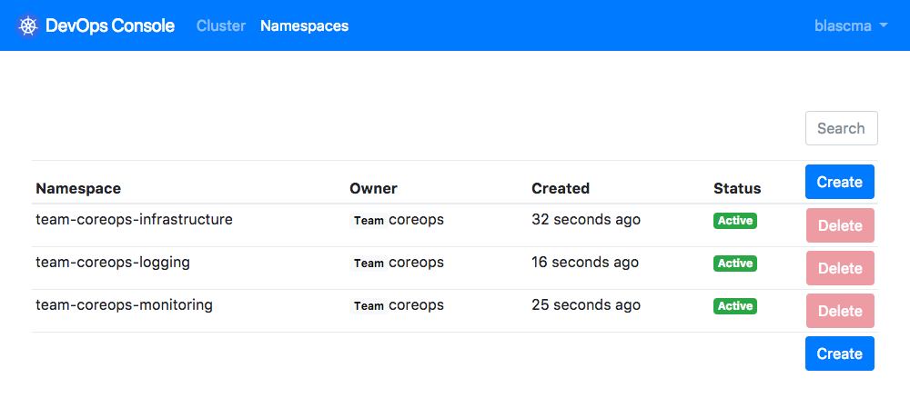

# K8s DevOps console



## Build (docker)

```bash
docker build -t webdevops/k8s-devops-console .
docker run --rm -p 9000:9000 -e KUBECONFIG=/root/.kube/config -v /path/to/your/kubeconfig:/root/.kube/config webdevops/k8s-devops-console
```

## Environment settings

| Env var               |Required       | Type     | Description                                                              |
|:----------------------|:--------------|:---------|:-------------------------------------------------------------------------|
| APP_SECRET            | no            | string   | Application secret for encryption (should be set, default is `random`)   |
| K8S_CONFIG            | no            | string   | Filename of `app.yaml` file                                              |
| KUBECONFIG            | no            | string   | Path to custom kubeconf (if not in-cluster)                              |
| OAUTH_PROVIDER        | yes           | string   | OAuth provider name (`github` or `azuread`)                              |
| OAUTH_CLIENT_ID       | yes           | string   | OAuth client id                                                          |
| OAUTH_CLIENT_SECRET   | yes           | string   | OAuth client secret                                                      |
| OAUTH_ENDPOINT_AUTH   | no            | string   | OAuth endpoint for auth                                                  |
| OAUTH_ENDPOINT_TOKEN  | no            | string   | OAuth endpoint for token exchange                                        |
| OAUTH_AZUREAD_TENANT  | yes (azuread) | string   | OAuth AzureAD tenant id (only provider "azuread")                        |
| K8S_CLUSTER_CA        | no            | string   | Kubernetes cluster CA (as base64 string) for kubeconfig generation       |
| K8S_CLUSTER_APISERVER | no            | string   | Kubernetes cluster apiserver url for kubeconfig generation               |
| K8S_OAUTH_SERVERAPP   | no            | string   | Kubernetes cluster OAuth server app ID for kubeconfig generation         |
| K8S_OAUTH_CLIENTAPP   | no            | string   | Kubernetes cluster OAuth client app ID  for kubeconfig generation        |
| K8S_OAUTH_TENANT      | no            | string   | Kubernetes cluster tenant ID for kubeconfig generation                   |


see [app.conf](conf/app.conf) for more environment settings and defaults

### OAuth

Supported providers:

- github ([create new application](https://github.com/settings/developers))
- AzureAD (Azure AD)

## TODO
- react single page app
- godep integration
- send notifcations
